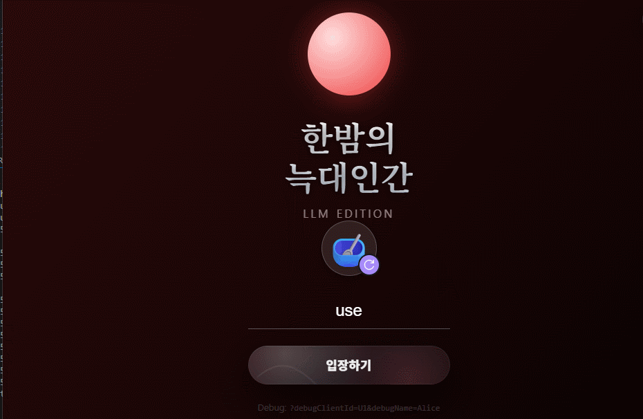

# 한밤의 늑대인간 LLM 에디션

스마트폰 브라우저로 접속하는 LAN 파티게임 프로토타입입니다. `FastAPI + WebSocket` 서버가 단일 방 상태를 관리하고, 정적 HTML/JS 클라이언트가 플레이어 화면, 호스트용 밤 진행, 투표 UI, 오디오 재생을 담당합니다.

현재 저장소 기준으로 확인되는 범위는 다음과 같습니다.

- 단일 방 기반 실시간 플레이
- 닉네임 + 아바타로 입장하는 모바일 UI
- 시나리오 선택, 게임 시작, 밤 진행, 토론, 투표, 결과 공개
- 시나리오 팩 3개, 에피소드 6개
- 생성된 TTS 클립 96개와 에피소드 합본 wav 6개 포함

## 화면과 오디오 미리보기

### 게임 화면

입장 화면



대기실과 시나리오 선택 화면


### TTS 샘플

README 뷰어가 `<audio>` 태그를 막는 경우, 바로 아래 링크로 파일을 열면 됩니다.

#### 4인 시나리오 오프닝

<audio controls src="public/assets/voices/four_player_story/ep1/p4/opening/001/voice.wav"></audio>

- 파일: [public/assets/voices/four_player_story/ep1/p4/opening/001/voice.wav](public/assets/voices/four_player_story/ep1/p4/opening/001/voice.wav)
- 예시 톤: "모두 눈을 감으세요. 네 명의 플레이어, 그리고 잠들지 못하는 밤입니다."

#### 기본 시나리오 늑대인간 역할 호출

<audio controls src="public/assets/voices/basic/ep1/p10/role/werewolf/during/001/voice.wav"></audio>

- 파일: [public/assets/voices/basic/ep1/p10/role/werewolf/during/001/voice.wav](public/assets/voices/basic/ep1/p10/role/werewolf/during/001/voice.wav)
- 예시 톤: "늑대인간, 눈을 뜨세요."

#### 에피소드 합본 샘플

<audio controls src="public/assets/voices/flexible_story/flexible_story__ep1__p8__episode.wav"></audio>

- 파일: [public/assets/voices/flexible_story/flexible_story__ep1__p8__episode.wav](public/assets/voices/flexible_story/flexible_story__ep1__p8__episode.wav)
- 설명: 오프닝, 역할 호출, 밤 종료 멘트를 한 파일로 합친 버전입니다.

## 이 프로토타입이 실제로 된 것

- 플레이어는 휴대폰 브라우저에서 방에 들어오고, 첫 입장자가 호스트가 됩니다.
- 호스트는 시나리오와 에피소드를 선택하고 게임을 시작합니다.
- 서버는 역할 덱 구성, 플레이어/센터 카드 배치, 단계 전환, 투표 집계, 결과 계산을 메모리에서 처리합니다.
- 클라이언트는 `WAIT -> ROLE -> NIGHT -> DEBATE -> VOTE -> RESULT` 흐름에 맞춰 화면을 바꾸고, 역할 확인/밤 행동/투표 모달을 렌더링합니다.
- 밤 진행은 호스트의 나레이션 재생과 플레이어 개인 화면 오버레이를 조합한 형태입니다.
- 호스트는 `액션 수행 기다림` 토글로 "행동 후 다음 대사로 넘어갈지"를 조절할 수 있습니다.
- 개발 모드에서는 `gameDebug` 콘솔 API, 강제 역할, WebSocket 봇 추가, 밤 UI 프리뷰까지 지원합니다.

현재 시나리오 팩 기준으로 실사용되는 역할 축은 `werewolf`, `minion`, `mason`, `seer`, `robber`, `troublemaker`, `drunk`, `insomniac`, `villager`, `witch`입니다.

## 현재 포함된 시나리오

| 시나리오 | 권장 인원 | 에피소드 | 실제 특징 |
| --- | --- | --- | --- |
| `basic` | 3~10인 | 2개 | 기본 입문형. `random_pool` 덱 선택으로 인원에 맞게 카드 구성이 달라집니다. |
| `flexible_story` | 3~8인 | 2개 | 인원 수에 따라 역할이 점차 확장되는 유연형 시나리오입니다. |
| `four_player_story` | 4인 | 2개 | 4인 전용으로 압축한 빠른 스토리형 시나리오입니다. |

## AI를 어디에 썼는가

이 프로젝트에서 AI는 "런타임 플레이어"보다 "콘텐츠 생성 파이프라인"에 가깝습니다.

- `scenarios/*.json`: 실제 게임 진행용 시나리오 데이터입니다. 역할 덱, 역할 호출 순서, 인원별 variant가 들어 있습니다.
- `scenarios_tts/*.tts.json`: TTS용 대사 소스입니다. 오프닝, 역할별 멘트, 밤 종료 멘트를 분리해 둡니다.
- `docs/LLM 스토리 생성 지침.md`: LLM이 어떤 형태의 JSON과 대사를 만들어야 하는지 정리한 생성 가이드입니다.
- `scripts/generate_scenario_audio.py`: 시나리오/TTS JSON을 읽어 `voice.wav`와 에피소드 합본 wav를 생성합니다.
- `scripts/gpt_sovits_tts.py`: GPT-SoVITS 또는 Windows TTS를 호출해 실제 음성을 만듭니다.
- `characters/`: 캐릭터별 참조 음성, 감정 태그, 보이스 매핑 설정을 관리합니다.

중요한 점:

- 게임 중에 LLM이 매 턴 판단을 내리지는 않습니다.
- 런타임은 먼저 미리 생성된 wav 자산을 재생합니다.
- 해당 wav가 없을 때만 브라우저 `speechSynthesis`로 텍스트를 읽는 fallback이 있습니다.

## 처음 기획 대비 달라진 점

- 실시간 LLM 게임 마스터보다는 "사전 생성 시나리오 + 사전 생성 음성" 구조로 정리됐습니다.
- 대규모 백엔드보다는 단일 프로세스, 단일 방, 메모리 상태 관리 쪽으로 단순화됐습니다.
- 로그인, 저장, 다중 방, 지속형 메타 진행보다 모바일 UI/밤 행동 UX/오디오 흐름에 집중했습니다.
- 시나리오 팩은 3개로 압축됐고, 긴 캠페인형 스토리보다 1회 플레이 가능한 라운드형 구조가 중심입니다.
- 디버그 도구와 역할 프리뷰 범위는 실제 번들 시나리오보다 더 넓습니다. 즉, 실험용 UI가 콘텐츠 팩보다 앞서 있습니다.

## 실행 방법

### Windows PowerShell

```powershell
.\run_dev.ps1
```

기본 포트는 `8001`입니다.

### macOS / Linux / WSL

```bash
python3 -m venv .venv
source .venv/bin/activate
pip install -r requirements.txt
python3 -m uvicorn server.main:app --host 0.0.0.0 --port 8001 --reload
```

접속 주소:

- 단독 실행: `http://localhost:8001`
- 같은 네트워크의 휴대폰: `http://<서버 IP>:8001`
- Weeks Game Hub와 함께 쓸 때: `http://localhost:3000/games/one-night-werewolf/`

## TTS 자산 작업

먼저 시나리오와 출력 경로만 확인하고 싶다면:

```bash
python3 scripts/generate_scenario_audio.py --scenario scenarios_tts/flexible_story.tts.json --dry-run
```

GPT-SoVITS 서버 연결만 확인하고 싶다면:

```bash
python3 scripts/tts_smoke_test.py --api-base http://127.0.0.1:9880 --ping-only
```

실제 음성 파일을 다시 만들 때:

```bash
python3 scripts/generate_scenario_audio.py \
  --scenario scenarios_tts/flexible_story.tts.json \
  --tts gpt-sovits \
  --characters-dir characters/Thema_01 \
  --api-base http://127.0.0.1:9880
```

## 디버그와 빠른 검증

`.\run_dev.ps1`로 실행하면 `DEBUG_COMMANDS=1`이 켜집니다. 브라우저 콘솔에서 다음 방식으로 빠르게 UI를 확인할 수 있습니다.

```js
gameDebug.ui.seedPlayers(5)
gameDebug.forceRole("seer")
gameDebug.ui.nightAction("robber")
gameDebug.ui.nightOpening()
```

이 기능은 스크린샷을 따거나 밤 행동 UX를 반복 확인할 때 특히 유용합니다.

## 폴더 가이드

- `server/`: FastAPI 서버, WebSocket 이벤트, 방 상태, 투표/결과 로직
- `public/`: 정적 클라이언트, CSS, UI 컴포넌트, 배경음, 생성된 음성 자산
- `scenarios/`: 실제 게임 진행용 시나리오 JSON
- `scenarios_tts/`: TTS 대사 소스 JSON
- `scripts/`: 음성 생성, wav 병합, 캐릭터 ref 검사, smoke test
- `characters/`: 역할/캐릭터별 음성 스타일과 감정 태그 설정
- `docs/`: LLM이 시나리오를 생성할 때 참고하는 규칙 문서

## 제한 사항과 검증 상태

- 현재 구조는 단일 방, 메모리 상태 기반입니다. 서버를 재시작하면 진행 상태가 유지되지 않습니다.
- 번들된 wav 자산은 시나리오별 대표 variant 중심으로 들어 있고, 런타임이 best-fit 방식으로 재사용하거나 브라우저 TTS로 fallback 합니다.
- 실험용 역할/음성 설정 파일은 더 많지만, 현재 번들 시나리오가 모두 사용하지는 않습니다.
- 자동 테스트는 아직 없습니다.

이번 README 개편 시점의 확인 기준:

- 확인함: 저장소 구조, 시나리오 JSON, TTS 매니페스트, 화면 GIF, 오디오 샘플 경로
- 확인함: `basic 32`, `flexible_story 36`, `four_player_story 28`개의 클립 매니페스트
- 확인 못 함: 이 쉘 환경에는 `fastapi`/`uvicorn`가 설치되어 있지 않아 서버를 직접 띄워 보는 런타임 검증은 수행하지 못했습니다.
